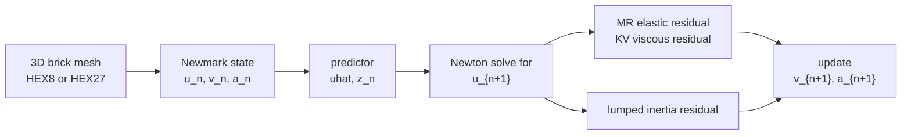
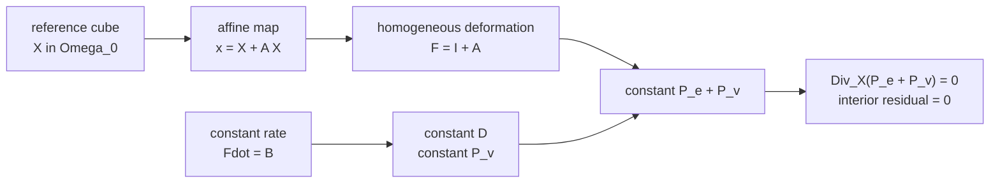
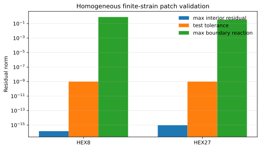
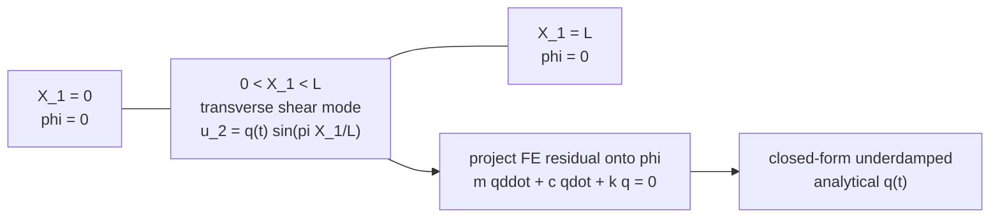
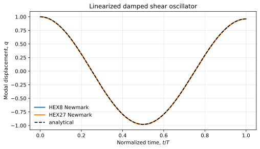
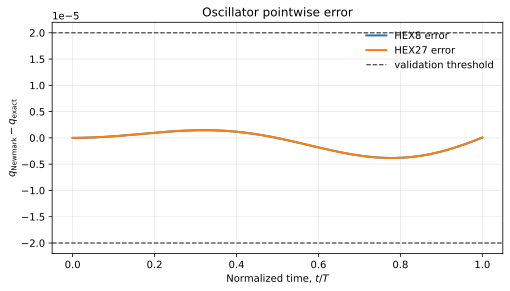

<span class="eyebrow">SFEM workflow validation</span>

# Mooney-Rivlin Kelvin-Voigt Newmark

This page documents the validation setup for the generated finite-strain operator `GeneratedMooneyRivlinKelvinVoigtNewmark`. The material is a compressible Mooney-Rivlin solid with a fully implicit finite-strain Kelvin-Voigt viscous stress, integrated in time with Newmark.

## Material Operator

The displacement is \(u(X,t)\), with deformation gradient

$$
F = I + \nabla_X u, \qquad J = \det F .
$$

The elastic energy density used by the generated operator is

$$
\psi_e(F)
=
\mu\left(I_1 - d + I_2 - \frac{d(d-1)}{2}\right)
+ \frac{\lambda}{2}(J-1)^2 ,
$$

where \(I_1 = \operatorname{tr}(C)\), \(I_2 = \frac{1}{2}(I_1^2-\operatorname{tr}(C^2))\), and \(C=F^T F\).

The viscous first Piola stress is

$$
P_v
=
J\left(2\eta_s\operatorname{dev}D+\eta_b\operatorname{tr}(D)I\right)F^{-T},
\qquad
D=\frac{1}{2}(L+L^T),
\qquad
L=\dot F F^{-1}.
$$

For Newmark, the generated operator receives a velocity-shift field \(z\) through the `previous` field:

$$
\dot F
=
\alpha_v\nabla_X u+\nabla_X z,
\qquad
\alpha_v = \frac{\gamma}{\beta\Delta t}.
$$

## Geometry and Time Update

The dynamic problem solved by the driver is

$$
M a_{n+1} + R_e(u_{n+1}) + R_v(u_{n+1}, z_n) = f_{n+1},
$$

with Newmark predictor

$$
\hat u = u_n+\Delta t\,v_n+\Delta t^2\left(\frac{1}{2}-\beta\right)a_n,
$$

and acceleration reconstruction

$$
a_{n+1} = \alpha_a(u_{n+1}-\hat u),
\qquad
\alpha_a = \frac{1}{\beta\Delta t^2}.
$$

The velocity shift used by the viscous operator is

$$
z_n
=
v_n+\Delta t(1-\gamma)a_n-\alpha_v\hat u.
$$



## Validation 1: Homogeneous Finite-Strain Patch

The first validation imposes an affine displacement field

$$
u(X)=A X,
\qquad
\dot F = B,
$$

where \(A\) and \(B\) are constant matrices. Therefore \(F\), \(D\), \(P_e\), and \(P_v\) are constant in the body, so the internal force must satisfy

$$
\operatorname{Div}_X(P_e+P_v)=0.
$$

The test checks that all interior nodal residuals are zero to roundoff while boundary nodes retain the expected reactions.





## Validation 2: Linearized Damped Shear Oscillator

The second validation uses a small-amplitude shear mode on a prismatic brick:

$$
u(X,t) = q(t)\,\phi(X),
\qquad
\phi(X)=\sin\left(\frac{\pi X_1}{L}\right)e_2 .
$$



For the selected Mooney-Rivlin energy, the small-strain shear modulus is \(4\mu\). The modal equation is

$$
m\ddot q + c\dot q + kq = 0,
$$

with continuum coefficients

$$
m = \frac{\rho A L}{2},
\qquad
k = \frac{4\mu A\pi^2}{2L},
\qquad
c = \frac{\eta_s A\pi^2}{2L}.
$$

For the underdamped case, the analytical solution is

$$
q(t)
=
e^{-\delta t}
\left[
q_0\cos(\omega_d t)
+ \frac{v_0+\delta q_0}{\omega_d}\sin(\omega_d t)
\right],
$$

where

$$
\omega_0=\sqrt{\frac{k}{m}},
\qquad
\delta=\frac{c}{2m},
\qquad
\omega_d=\sqrt{\omega_0^2-\delta^2}.
$$





## Reproducing the CSV and Plots

From the SFEM source repository, build the two validation targets and run:

```bash
PYTHONPATH=python venv/bin/python workflows/mooney_rivlin_kelvin_voigt_newmark/generate_validation_csv_and_plots.py
```

This writes:

- `homogeneous_residuals.csv`
- `oscillator_metrics.csv`
- `oscillator_samples.csv`
- `homogeneous_residuals.svg`
- `oscillator_response.svg`
- `oscillator_error.svg`

By default the files are written to `workflows/mooney_rivlin_kelvin_voigt_newmark/validation`.
